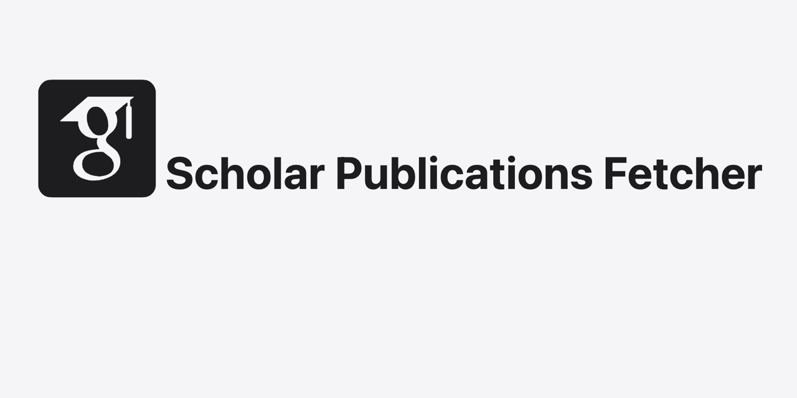

# Google Scholar to JSON - Fetch Publications

## Overview

This project allows users to convert Google Scholar profiles to JSON format. Users can fetch publication data using a Google Scholar ID or URL, and sort the results by publication date or citation count. The application consists of a humble setup using old and good HTML/CSS/JS, a simple Python script, and GitHub as a database.

## Features

- Convert Google Scholar profiles to JSON.
- Fetch publication data using Google Scholar ID or URL.
- Sort results by publication date or citation count.

## How It Works

### 1. Frontend

The frontend is a simple old and good HTML form where users can enter their Google Scholar ID or URL and select the sort order. It also displays the JSON result and provides options to copy the JSON to clipboard or download it as a file.

### 2. Vercel Serverless Function

The serverless function deployed on Vercel handles the API requests. It fetches the publication data from the GitHub repository and returns it as JSON.

### 3. GitHub Actions Workflow

The GitHub Actions workflow is triggered when a new scholar ID is submitted. It fetches the publication data from Google Scholar using the `scholarly_publications` python package, saves it as a JSON file in the repository, and updates the repository.

## Contributing

Contributions are welcome! Please open an issue or submit a pull request for any improvements or new features.

## License

This project is licensed under the MIT License. See the [LICENSE](LICENSE) file for details.
